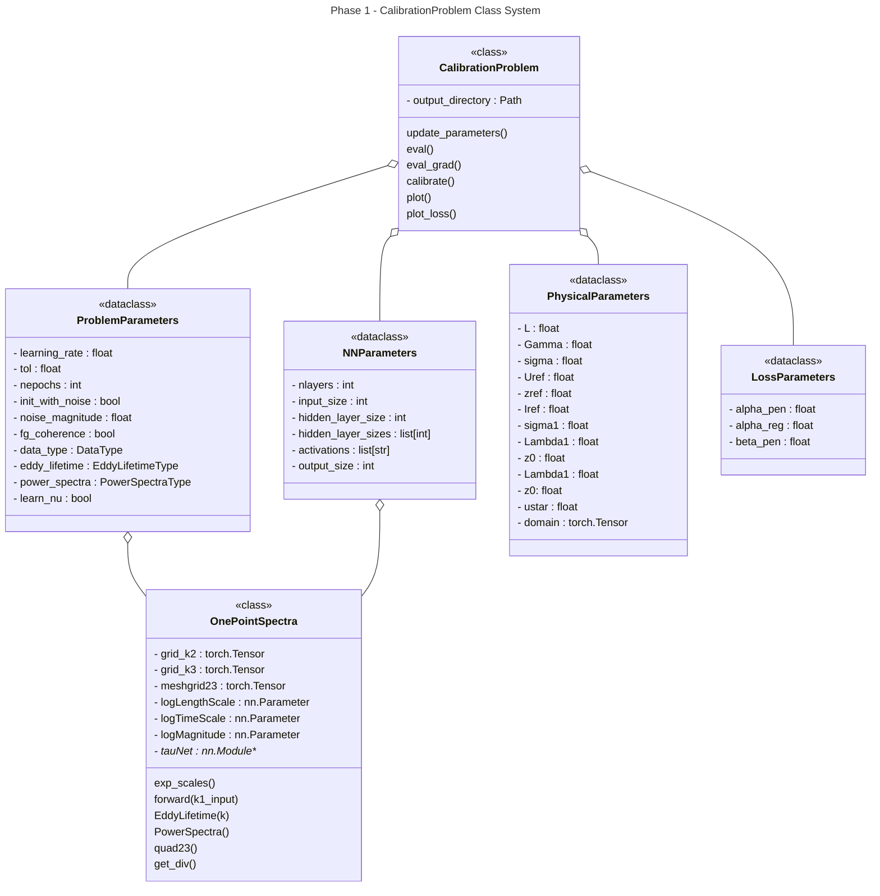

# Deep Rapid Distortion theory Mann Turbulence model

The code is based on the original work of Jacob Mann in [1994](https://doi.org/10.1017/S0022112094001886) and [1998](https://doi.org/10.1016/S0266-8920(97)00036-2)
as well as in the deep-learning enhancement developed by Keith et al and presented in [this 2021 publication](https://arxiv.org/pdf/2107.11046.pdf). 

## Baselines

See the ``/examples/`` folder for baselines from the paper and for several functionalities of the package.

### Noisy Data (Experiment 2) 

Using a 4-layer 32-neuron FC neural network with a CosineAnnealer, these are the results after 10 epochs, which have a minimum loss value of  
``loss = 0.14850306846012104``, as compared to 100 epochs yielding ``loss = 0.20783722970539706`` before. 

## Development Installation Instructions 

This package is provided as a locally ``pip``-installable package. It is recommended that Python 3.9 is used in your local environment. 

A Conda spec-file is included, to install a functioning environment, run ``conda create --name ENV_NAME_HERE --file spec-file.txt``. Then run ``pip install -e .`` to load ``drdmannturb`` into your environment. 

## Doc Building Instructions 

Docs are in the ``/docs/`` folder. Make sure the following dependencies are installed:

Run ``make html`` to generate html pages in the ``/docs/build/html`` folder, which can be hosted locally with ``python -m http.server <PORT-NUMBER>``. 
