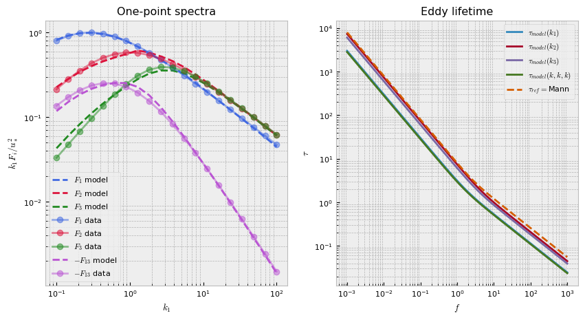

# Summary

Synthetic turbulence models (STMs) are commonly used to generate realistic flow fields and employed as inputs to a variety of models. Examples include the creation of inlet conditions for unsteady computational fluid dynamics (CFD) models, inflow wind fields to aeroelastic models of wind turbines or tall building, amongst many others. One of the advantages of STMs 
is their ability to generate fluctuations based on prescribed second-order statistics, which allows scientists and engineers to simulate and re-create environmental conditions as close as possible to the observed ones. The Mann model [@mann_spatial:1994; @mann_wind:1998], which is the inspiration for this package, allows for the prescription of three parameters: the Kolmogorov constant multiplied by the rate of the viscous dissipation of specific turbulence kinetic energy to the two thirds, $\alpha \epsilon^{2/3}$, a turbulence length scale, $L$, and a non-dimensional parameter related to the lifetime of the eddies, $\Gamma$. A number of studies as well as international standards (e.g., the International Electrotechnical Commission) have made recommendations for the values of these three parameters ($\alpha \epsilon^{2/3}$, $L$, $\Gamma$) with the goal to fit turbulence spectra or coherence functions from measurements or reference or textbook spectra. This package allows users to easily fit the Mann model to turbulence characteristics by not only modifying the aforementioned parameters, but also by adjusting the function related to the lifetime of the eddies using deep neural networks (DNN). Following [Keith:2021], we refer to the class of models where the neural network is used to approximate the unknown eddy lifetime function as deep rapid distortion (DRD) models. This new approach has been found to provide excellent results with either smooth and noisy data. 

# Statement of need

`DRDMannTurb` is a package that aims to create an easy-to-use framework to (1) automatically determine a surrogate model for observed wind spectra from data using the DRD models introduced in [Keith:2021] and (2) to automatically generate turbulent fluctuation fields to be used by scientists and engineers in downstream tasks. Existing methodologies for generating fluctuation fields frequently incur a large computational overhead and moreover are not flexible enough to mimic physical properties of real-world observations. `DRDMannTurb` addresses these two issues by introducing a module for fitting neural network-based models to observed one-point spectra data and for sequentially generating 3D blocks of synthetic turbulence rather than for the entire domain at once, a highly memory-intensive practice used in some other software.  

`DRDMannTurb` is completely written in Python, with computationally powerful backend packages ('numpy', 'PyTorch') being leveraged in its implementation. Our implementation allows for easy GPU-portability using `cuda`. This is an additional advantage compared to previously developed software packages that have implemented the Mann model but do not provide the source code (e.g., HAWC2). Finally, `DRDMannTurb` is designed to be more general-purpose, allowing it to be applied in a broader range of scenarios, as well as be more accessible and with clear documentation of a variety of tasks that researchers in this area frequently use. 

# Results

The output of the fitting component of ``DRDMannTurb`` consists of two parts: the spectra fit by a DRD model and the learned eddy lifetime function. Below, a sample fitting is provided for the Kaimal spectra and Mann model. The resulting fit is better than a fit by the Mann uniform shear model. 

For more detailed discussions of results, please see the official examples.  

# Package Features

- Generates synthetic turbulence fields using the Classic Mann model
- Calibrate the Mann model parameters using reference "textbook" or in-situ spectra and co-spectra
- Calibrate the DRD model using a flexible suite of neural network architectures for the eddy lifetime functions
- Fast fluctuation field generation using a domain decomposition approach

# Acknowledgements

This work was authored (in part) by the National Renewable Energy Laboratory, operated by Alliance for Sustainable Energy, LLC, for the U.S. Department of Energy (DOE) under Contract No. DE-AC36-08GO28308. Funding provided by the U.S. Department of Energy Office of Energy Efficiency and Renewable Energy Wind Energy Technologies Office. The views expressed in the article do not necessarily represent the views of the DOE or the U.S. Government. The U.S. Government retains and the publisher, by accepting the article for publication, acknowledges that the U.S. Government retains a nonexclusive, paid-up, irrevocable, worldwide license to publish or reproduce the published form of this work, or allow others to do so, for U.S. Government purposes. 

# References
