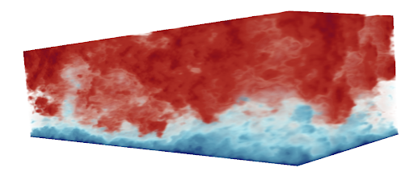

# Summary

Synthetic turbulence models (STMs) are used in wind engineering to generate realistic flow fields 
and are employed as inputs to industrial wind simulations. Examples include prescribing inlet conditions
in large eddy simulations that model loads on wind turbines and tall buildings. We are interested in STMs 
capable of generating fluctuations based on prescribed second-moment statistics since such models can
simulate environmental conditions that closely resemble on-site observations. To this end, the 
widely used Mann model [@mann_spatial:1994; @mann_wind:1998] is the inspiration for `DRDMannTurb`. 
The Mann model is described by three physical parameters: a magnitude parameter influencing the global variance of
the wind field and corresponding to the Kolmogorov constant multiplied by the rate of viscous dissipation of the
turbulent kinetic energy to the two-thirds, $\alpha \epsilon^{2/3}$, a turbulence length scale parameter $L$, and a 
non-dimensional parameter $\Gamma$ related to the lifetime of the eddies. A number of studies, as 
well as international standards (e.g., those by the International Electrotechnical Commission (IEC)), include 
recommended values for these three parameters with the goal of standardizing wind 
simulations according to observed energy spectra. Yet, having only three parameters, the Mann model faces 
limitations in accurately representing the diversity of observable spectra. This Python package 
enables users to extend the Mann model and more accurately fit field measurements through flexible
neural network models of the eddy lifetime function. Following [@Keith:2021], we refer to this class 
of models as Deep Rapid Distortion (DRD) models.
`DRDMannTurb` also includes a general module implementing an efficient method for synthetic turbulence generation based on
a domain decomposition technique. This technique is also described in [@Keith:2021].

# Statement of need

`DRDMannTurb` aims to provide an easy-to-use framework to (1) fit one-point spectra from data using
the DRD model introduced in [@Keith:2021] and (2) efficiently generate synthetic turbulence 
velocity fields to be used by scientists and engineers in downstream tasks. Existing methodologies 
for generating synthetic turbulence frequently incur a large computational overhead and lack 
DRD models' flexibility to represent the diverse spectral properties of real-world observations, 
cf. [@Liew:2022]. `DRDMannTurb` addresses these two issues by introducing (1) a module for fitting DRD 
models to observed one-point spectra data, as well as (2) a module for 
efficiently generating synthetic turbulence boxes. Rather than generating turbulence over an
entire domain at once, which can end up being a highly memory-intensive practice, 
`DRDMannTurb` uses a domain decomposition approach to generate smaller sub-boxes 
sequentially.

`DRDMannTurb` is written in Python and leverages computationally powerful backend packages like
`numpy` and `PyTorch`. The implementation makes DRD models easily portable to GPU and other backends via `PyTorch`. 
This is an additional advantage compared to other software packages that implement the 
Mann model, but for which the source code may not be public or freely available (e.g., HAWC2 [@wes-5-1-2020]). 
Finally, `DRDMannTurb` is designed to be more general-purpose, allowing it to be applied to a broader range of scenarios
and to be very accessible, with clear documentation and examples spanning a variety of tasks that researchers
may be interested in. 

# Results

The output of the fitting component of ``DRDMannTurb`` consists of two parts: the spectra fit by a 
DRD model and the learned eddy lifetime function. For example, in the case of the Kaimal spectra, the 
DRD spectra fit is more accurate than the Mann uniform shear model while providing an 
estimate of the same three physical parameters.

After fitting to the spectra, the resulting models can also be used to generate 3D wind fields with 
spectra more closely resembling the same observations used in training.

For more detailed discussions of results, including a variety of utilities for interpolating and 
filtering noisy real-world data and generating wind turbulence; please see the 
[official examples](https://methods-group.github.io/DRDMannTurb/examples.html).

# Package Features

- Calibrate the Mann model parameters using reference "textbook" or in situ spectra and co-spectra
- Calibrate the DRD model using a flexible suite of neural network architectures for the eddy lifetime functions
- Generate synthetic turbulence fields using the classical Mann model
- Use a state-of-the-art domain decomposition approach for fast synthetic turbulence generation

# Acknowledgements

This work was authored in part by the National Renewable Energy Laboratory, operated by Alliance for Sustainable Energy, LLC, for the U.S. Department of Energy (DOE) under Contract No. DE-AC36-08GO28308. Funding provided by the U.S. Department of Energy Office of Energy Efficiency and Renewable Energy Wind Energy Technologies Office. The views expressed in the article do not necessarily represent the views of the DOE or the U.S. Government. The U.S. Government retains and the publisher, by accepting the article for publication, acknowledges that the U.S. Government retains a nonexclusive, paid-up, irrevocable, worldwide license to publish or reproduce the published form of this work, or allow others to do so, for U.S. Government purposes. BK was supported in part by the U.S. Department of Energy Office of Science, Early Career Research Program under Award Number DE-SC0024335.

# References
