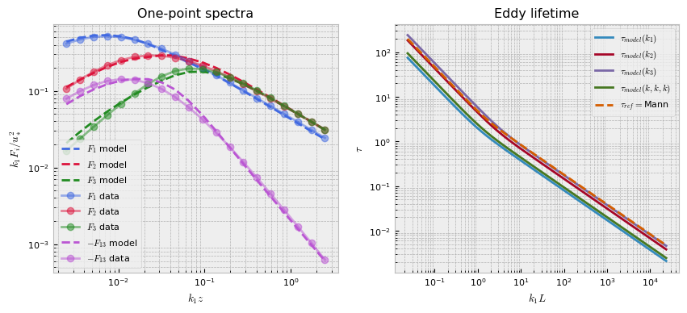

# Summary

Synthetic turbulence models (STMs) are commonly used to generate realistic flow fields and employed as inputs to wind simulations. Examples include prescribing inlet conditions and inflow wind fields to model loads on wind turbines and tall buildings. We are interested in STMs able to generate fluctuations based on prescribed second-moment statistics as this allows scientists and engineers to simulate many environmental conditions as close as possible to on-site measurements. The Mann model [@mann_spatial:1994; @mann_wind:1998], which is the inspiration for this software package, contains three physical parameters: a magnitude parameter corresponding to the Kolmogorov constant multiplied by the rate of the viscous dissipation of specific turbulence kinetic energy to the two thirds, $\alpha \epsilon^{2/3}$, a turbulence length scale parameter, $L$, and a non-dimensional parameter $\Gamma$ related to the lifetime of the eddies. A number of studies as well as international standards (e.g., the International Electrotechnical Commission) include recommendations for the values of these three parameters with the goal of standardizing wind simulations to have realistic energy spectra. Yet, having only three parameters, the Mann model faces limitations in accurately representing the diversity of observable spectra. This Python package, `DRDMannTurb`, allows users to extend the Mann model and more accurately fit field measurements through a neural network model of the eddy lifetime function. Following [Keith:2021], we refer to this class of models as deep rapid distortion (DRD) models. Once fitted, a DRD model is no more expensive for simulating turbulence than a Mann model. Moreover, `DRDMannTurb` comes with a state-of-the-art domain decomposition-based simulator for generating turbulence boxes for both the Mann and DRD models.

# Statement of need

`DRDMannTurb` aims to create an easy-to-use framework to (1) fit one-point spectra from data using the DRD model introduced in [Keith:2021] and (2) to efficiently generate synthetic turbulence velocity fields to be used by scientists and engineers in downstream tasks. Existing methodologies for generating synthetic turbulence frequently incur a large computational overhead and lack the flexibility to represent the diverse spectral properties of real-world observations. `DRDMannTurb` addresses these two issues by introducing (1) a module for fitting neural network-based DRD models to observed one-point spectra data as well as (2) a module for efficiently generating synthetic turbulence boxes. Rather than generating turbulence for the entire box at once, a highly memory-intensive practice used in other software, `DRDMannTurb` uses a state-of-the-art domain decomposition approach to generate smaller sub-boxes sequentially.

`DRDMannTurb` is completely written in Python, leveraging computationally powerful backend packages (`numpy`, `PyTorch`). Our implementation allows for easy GPU-portability using `cuda`. This is an additional advantage compared to previously developed software packages that have implemented the Mann model but do not provide the source code (e.g., HAWC2). Finally, `DRDMannTurb` is designed to be more general-purpose, allowing it to be applied in a broader range of scenarios, as well as be more accessible and with clear documentation of a variety of tasks that researchers in this area frequently use. 

# Results

The output of the fitting component of ``DRDMannTurb`` consists of two parts: the spectra fit by a DRD model and the learned eddy lifetime function. Below, a sample fitting is provided for the Kaimal spectra and Mann model. Our spectra fit is more accurate than that of the Mann uniform shear model. 

 { width=49% }  { width=49% }

After fitting to the spectra, the resulting models can also be used to generate 3D wind fields with spectra closely resembling those of the observations used in training. 

For more detailed discussions of results, please see the official examples.  

# Package Features

- Generates synthetic turbulence fields using the classical Mann model
- Calibrate the Mann model parameters using reference "textbook" or in-situ spectra and co-spectra
- Calibrate the DRD model using a flexible suite of neural network architectures for the eddy lifetime functions
- Fast synthetic turbulence generation using a state-of-the-art domain decomposition approach

# Acknowledgements

This work was authored (in part) by the National Renewable Energy Laboratory, operated by Alliance for Sustainable Energy, LLC, for the U.S. Department of Energy (DOE) under Contract No. DE-AC36-08GO28308. Funding provided by the U.S. Department of Energy Office of Energy Efficiency and Renewable Energy Wind Energy Technologies Office. The views expressed in the article do not necessarily represent the views of the DOE or the U.S. Government. The U.S. Government retains and the publisher, by accepting the article for publication, acknowledges that the U.S. Government retains a nonexclusive, paid-up, irrevocable, worldwide license to publish or reproduce the published form of this work, or allow others to do so, for U.S. Government purposes. 

# Citations 
- `@Keith:2021` -> "Keith et al. (2021)"

# References
